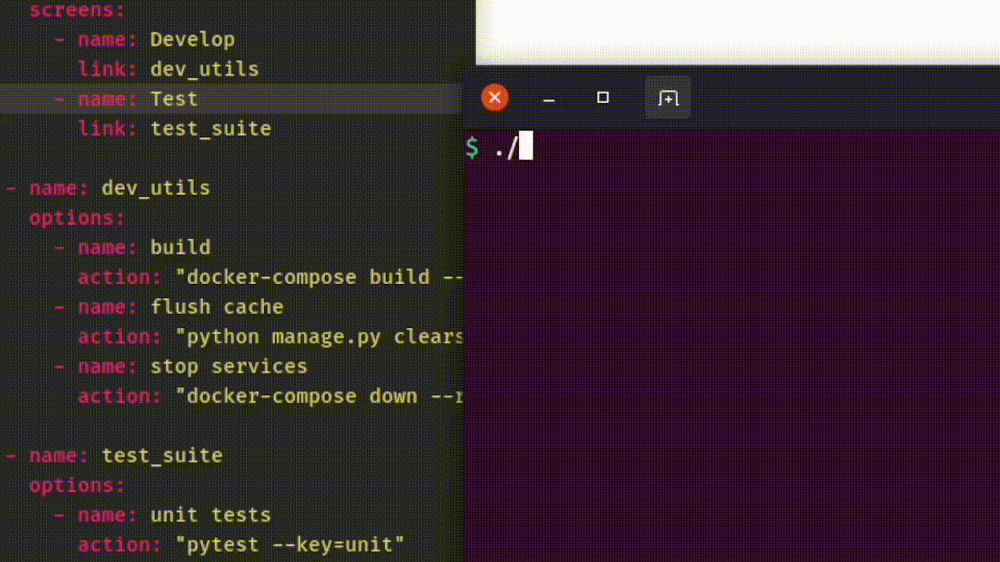

Nacar is a tool for creating interactive text-based interfaces from simple user-defined blueprints.  
Say goodbye to remembering long, arcane shell commands!

**Above: a Nacar YAML blueprint (left) and the resulting bash Nacar app running in the terminal (right).** 

You write a blueprint as a single YAML file, specifying the options and commands 
that should appear on each screen. Add links between screens for fluid 
keyboard-based navigation. Nacar will take that blueprint and produce a 
self-contained bash script containing your interface.

Both locally and on the server Nacar shines at creating management and 
health-check utilities that provide easy access to common tasks.     

    
    
    
    
    

## Install & run

1. Clone the repo.
2. Write a Nacar blueprint - you can use `blueprint.example.yml` as a template.
3. Create & activate a virtual environment: `python3 -m venv venv && source venv/bin/activate`
4. Install dependencies: `pip3 install -r requirements/common.txt`
5. Add the current directory to the `PYTHONPATH` with `export PYTHONPATH="$PWD"`
6. Run `python3 nacar/main.py <path-to-your-blueprint>.yml`

A bash Nacar app will have been created in the same directory as your blueprint.
You can run this like any other bash script. 

## Develop

Nacar is written in Python 3. It includes type annotations that are checked with 
`mypy` and is linted with `pycodestyle` to ensure PEP8 compliance.  
If you wish to make changes to Nacar itself, read the **Project Structure** 
section below for details on how the code is structured.

Install the `pre-commit` git hook provided under `/hooks/` to have the following 
steps performed before each commit:
- Checking type annotations with `mypy`.
- Lint in accordance with PEP8 with `pycodestyle`.
- Run the full test suite.
- Update test result and version badges in the README.  

You may also manually invoke the  `pre_commit_checks.sh` script to perform the above checks at any time.

Check the [feature roadmap](ROADMAP.md) to see planned & in-progress improvements to Nacar.

### Test
A suite of unit & integration tests is held under `/tests/`. To run it, install 
the dev requirements as detailed above and run `pytest` from the project root.  
[Read more](docs/Tests.md) about how tests are structured, available fixtures
 & test data, and running tests from PyCharm.

## Project Structure

### Dependencies
Python dependencies are defined by two files in the `requirements` directory and 
can be installed using `pip`.  
`common.txt` defines the requirements necessary both for development and runtime, 
namely PyYAML for parsing YAML files and Cerberus for schema validation.  
`dev.txt` defines packages necessary only for development tasks, such as linting
and checking types.

### Application Entrypoint
The `main.py` module is the script's entrypoint when it is run from the command
line. It is responsible for running initial checks, and orchestrating the core 
functionalities such as reading YAML blueprints, parsing them into an in-memory 
representation, validating the blueprint, translating to the target language, 
and persisting the result to a file.

[Read more](docs/Entrypoint.md) about Nacar's entrypoint.

### Filesystem operations
The `file_io` module parses YAML files as input and writes in-memory 
representations of Nacar apps out as executable files. It is responsible for 
interacting with the filesystem, setting permissions on resulting apps, and 
handling any I/O exceptions.

[Read more](docs/FileIO.md) about reading from and writing to files. 

### Blueprint Schema & Validator
The `schema` module defines the rules used for validating parsed blueprints.  
Nacar's `validator` module verifies that the parsed blueprint will be correctly 
interpreted by a Translator (see below). It is built on top of the Cerberus 
validator, checking the uniqueness of screen names, avoiding screens linking to 
themselves, and that 'link' directives point to existing screens.

[Read more](docs/Schema_Validator.md) about the blueprint Schema & Validator.

### Translators
Translators are packages that take a Python object (previously parsed from a 
YAML blueprint) and turn it into a Nacar application written in a target 
language such as Bash. Translators live in the `translate` package along 
with an `itranslator.py` interface that defines the methods a translator 
should implement.

[Read more](docs/Translators.md) about Translators.

---
**What's in a name?**  
*Nácar* means 'mother of pearl' in Spanish. This name reflects the tool's 
aim to make interacting with the shell smoother and more beautiful.

---
Copyright 2022 Alberto Morón Hernández  
This software is provided as open-source under the MIT License.
